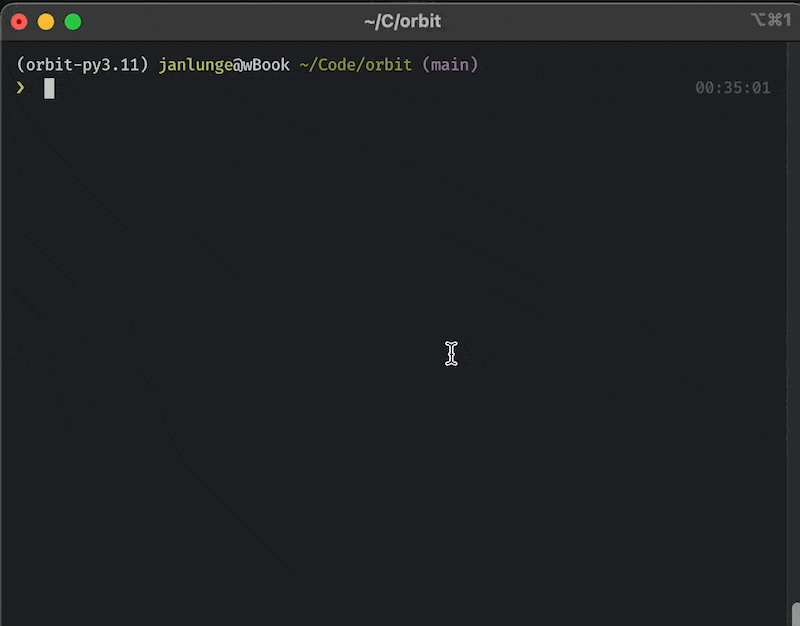

<h1 align="center">Orbit
</h1>
<h4 align="center">
a modular platform for building a voice based LLM assistant</h4>

    
    

# services
* ⚙️ Command service for custom executable commands
* ❗️ Hotword detection with porcupine
* 🧠 LLM AI integration with OpenAi or local inference (llama.cpp)
* 🎧 whisper speech recognition
* 🎤 audio streaming via mqtt (audio_satelite)
* 💬 TTS via elevenlabs, pyttsx3 or macos say

## what is this?
Build your own jarvis or alexa/siri/google assistant with this modular platform. 
it will listen for audio with a microphone streamer via mqtt, 
then a hotword module will trigger the hotword event if you say the hotword/wakeword atlas
then the audio will be streamed to a whisper speech recognition module that will return the text
then the text will be sent to an AI module that will return a response
then the text will be sent to a command module that will execute the command
then the response will be sent to a TTS module that will speak the response

This has been tested on an m1 mac

## TODOs:
- [ ] implement function calling in the ai module so the ai can trigger commands
- [ ] create a management interface for the function calling
- [x] support local inference with custom models
- [ ] switch to something like fastchat instead of llama.cpp for local inference 
- [ ] support large context models
- [ ] support multiple wake words
- [ ] saving context in interactions for the ai
- [ ] vector store for permanent information?
- [ ] already speak chunks of responses when streaming inference content to speed up response time
- [ ] ignore the hotword if the ai is speaking or the user is speaking
- [ ] test if instruct models work better as agents
- [ ] figure out a way for the agent to still preserve character and answer normal questions casually

current token limitations make the function calling not really feasible but in the close future you will be able to use your computer or other api apps just with your voice,
AI will be the interface between you and your computer. get in now and be ready for the future!

# requirements
- a Mqtt server

on OSX install one with `brew install mosquitto` then manage it with `brew services start mosquitto`
and 
`brew services stop mosquitto`
* `ffmpeg` for the whisper speech recognition
* a working `pyaudio` installation

# optional
- openai api key into .env named OPENAI_API_KEY (if you use chatgpt in the ai.py file)
- a porcupine hotword model and access key
- an elevenlabs api key for tts

# Setup
1. get a poetry shell with `poetry shell`
2. install the dependencies with `poetry install`
3. then run `python3 main.py` to start the program

# Notes
using local models works best in simple mode as most ai models do not work well with the reasoning chains in langchain and will produce nonsense
using openai works very well as agent in the advanced mode

# training an intent model:
in the ludwig folder do `ludwig train --dataset sequence_tags.csv --config config.yaml`

## Project Structure

